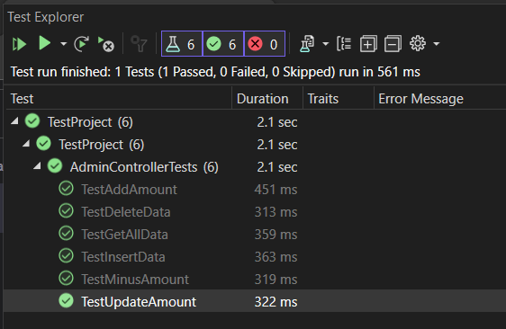

# Assignment 3: Testing

# FarmInventory

FarmInventory is a Windows desktop application that helps manage the inventory and sales of products in a farm. It provides features for adding new products, updating product quantities, and making sales.

## Getting Started

To run the application, follow these steps:

1. Clone the repository or download the source code.
2. Open the solution in Visual Studio.
3. Build the solution to restore NuGet packages and compile the project.
4. Set the `FarmInventory` project as the startup project.
5. Run the application.

## Project Structure

The project consists of the following files:

- `Product.cs`: Defines the `Product` class representing a farm product. It contains properties for the product's name, ID, amount, and price.
- `CartItem.cs`: Defines the `CartItem` class representing an item in the customer's cart. It contains properties for the product name, ID, amount purchased, price per kg, and subtotal.
- `AdminController.cs`: Contains the `AdminController` class responsible for handling operations related to the admin functionality. It includes methods for inserting new products, retrieving all products, searching for products by ID, deleting products, and updating product quantities.
- `SalesController.cs`: Contains the `SalesController` class responsible for handling operations related to the sales functionality. It includes methods for calculating subtotals and the final total price of cart items, retrieving products from the database, adding cart items, and getting cart items.
- `MainWindow.xaml.cs`: Contains the code-behind logic for the main window of the application. It handles button click events for the "Admin" and "Sales" buttons, opening the corresponding windows.
- `MainWindow.xaml`: Defines the XAML markup for the main window UI, including buttons and labels.
- `Admin.xaml.cs`: Contains the code-behind logic for the Admin.xaml user interface. It handles the event handling and interaction with the admin-related functionality.
- `Admin.xaml`: This XAML file defines the visual layout and design for the admin interface. It specifies the user interface controls, layout containers, and bindings to display and manage the admin-related features.
- `Sales.xaml.cs`: The Sales.xaml.cs file contains the code-behind logic for the Sales.xaml user interface. It handles the event handling and interaction with the sales-related functionality.
- `Sales.xaml`: This XAML file defines the visual layout and design for the sales interface. It specifies the user interface controls, layout containers, and bindings to display and manage the sales-related features.

## Dependencies

The project has the following dependencies:

- Npgsql: A .NET data provider for PostgreSQL. It is used for connecting to the PostgreSQL database and executing queries.


# Unit Test Documentation for AdminController

This documentation provides an overview of the unit tests implemented in the `AdminControllerTests` class within an NUnit test project. These tests are designed to ensure the proper functioning of the methods within the `AdminController` class.

## Table of Contents
- [Introduction](#introduction)
- [Setup](#setup)
- [Test Cases](#test-cases)
  - [TestInsertData](#testinsertdata)
  - [TestGetAllData](#testgetalldata)
  - [TestDeleteData](#testdeletedata)
  - [TestAddAmount](#testaddamount)
  - [TestMinusAmount](#testminusamount)
  - [TestUpdateAmount](#testupdateamount)

## Introduction
The `AdminControllerTests` class, located within an NUnit test project, inside UnitTest1.cs, contains a series of unit tests that evaluate the functionality of the methods within the `AdminController` class. These tests verify the correctness of methods responsible for inserting, retrieving, updating, and deleting data from the database.

## Setup
The `Setup` method is executed before each test case, initializing an instance of `AdminController` for testing.

```csharp
[SetUp]
public void Setup()
{
    // Arrange: Initialize the AdminController instance
    adminController = new AdminController();
}
```

## Test Cases

### TestInsertData
This test case verifies the `InsertData` method of `AdminController`. It checks whether the provided product data is correctly inserted into the database.

#### Test Steps:
1. Prepare test data, including name, ID, amount, and price.
2. Call the `InsertData` method of `AdminController` with the prepared data.
3. Query the database to retrieve the inserted data and compare it with the expected values.

### TestGetAllData
This test case checks the functionality of the `GetAllData` method within `AdminController`. It ensures that the method successfully retrieves a list of products from the database.

#### Test Steps:
1. Call the `GetAllData` method of `AdminController`.
2. Verify that the returned list of products contains more than 0 items.

### TestDeleteData
This test case tests the `DeleteData` method of `AdminController`. It verifies whether the method correctly deletes a product from the database based on the provided ID.

#### Test Steps:
1. Prepare an ID of the product to be deleted.
2. Call the `DeleteData` method of `AdminController` with the prepared ID.
3. Query the database to check if the product with the specified ID no longer exists.

### TestAddAmount
This test case validates the `AddAmount` method of `AdminController`. It checks whether the method successfully adds a specified amount to the existing amount of a product.

#### Test Steps:
1. Prepare an ID of the product and the amount to be added.
2. Call the `AddAmount` method of `AdminController` with the prepared ID and amount.
3. Query the database to retrieve the updated amount and compare it with the expected value.

### TestMinusAmount
This test case examines the `MinusAmount` method of `AdminController`. It ensures that the method correctly reduces the amount of a product by a specified value.

#### Test Steps:
1. Prepare an ID of the product and the amount to be subtracted.
2. Call the `MinusAmount` method of `AdminController` with the prepared ID and amount.
3. Query the database to retrieve the updated amount and compare it with the expected value.

### TestUpdateAmount
This test case validates the `UpdateAmount` method of `AdminController`. It checks whether the method correctly updates the amount of a product to a specified value.

#### Test Steps:
1. Prepare an ID of the product and the updated amount.
2. Call the `UpdateAmount` method of `AdminController` with the prepared ID and amount.
3. Query the database to retrieve the updated amount and compare it with the expected value.

---

These unit tests, implemented within an NUnit test project, provide comprehensive coverage of the `AdminController` methods. By running these tests, you can ensure the proper functioning of the methods and their interactions with the database.

## Images

||
|:--:|
|Figure 1: Test Explorer|

